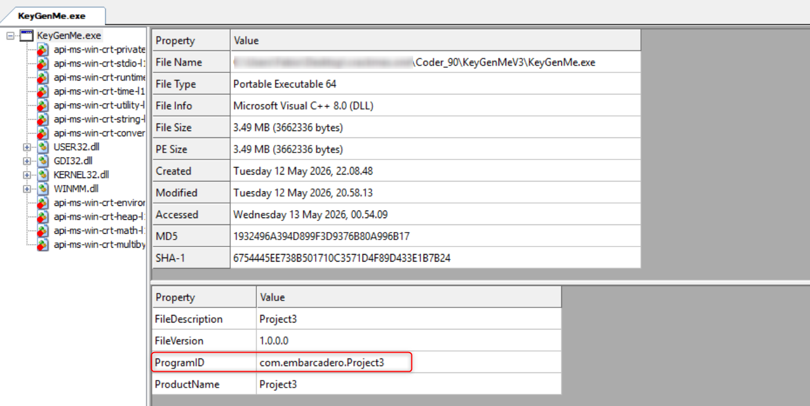
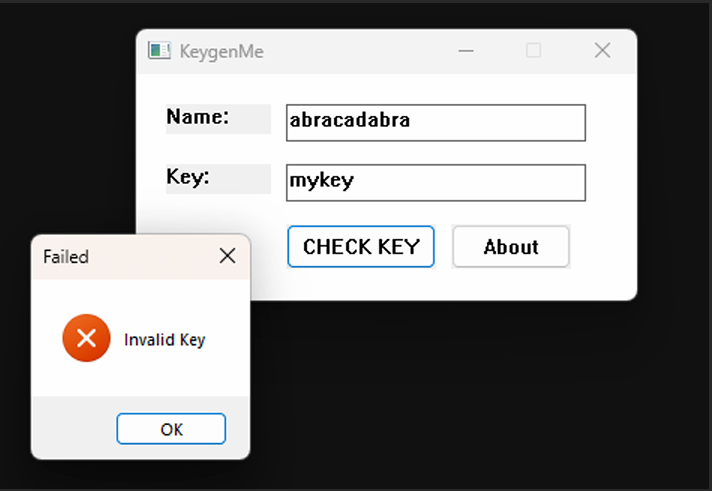
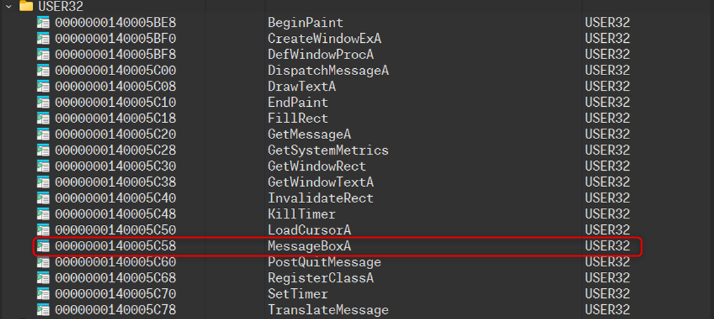
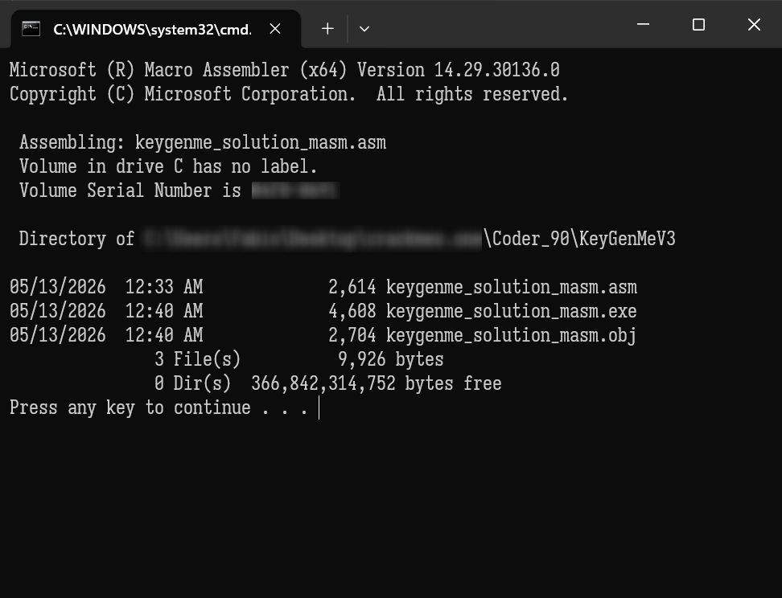
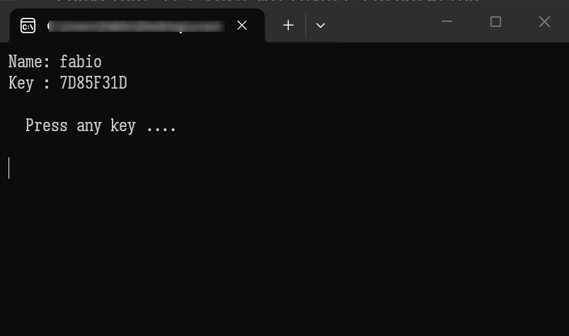
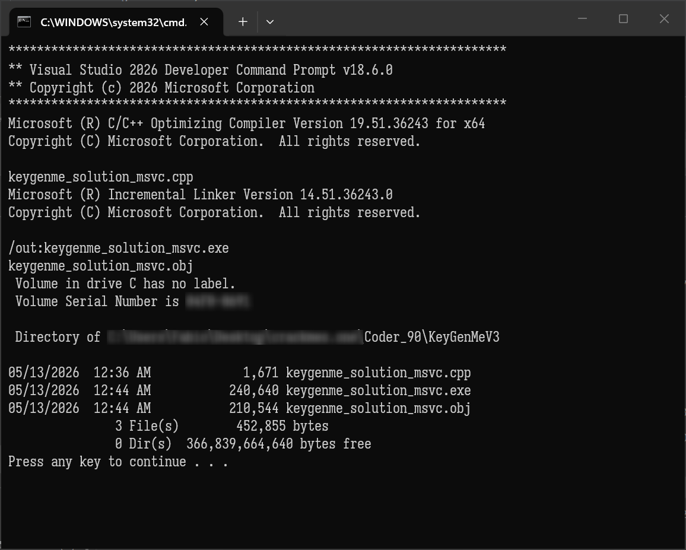
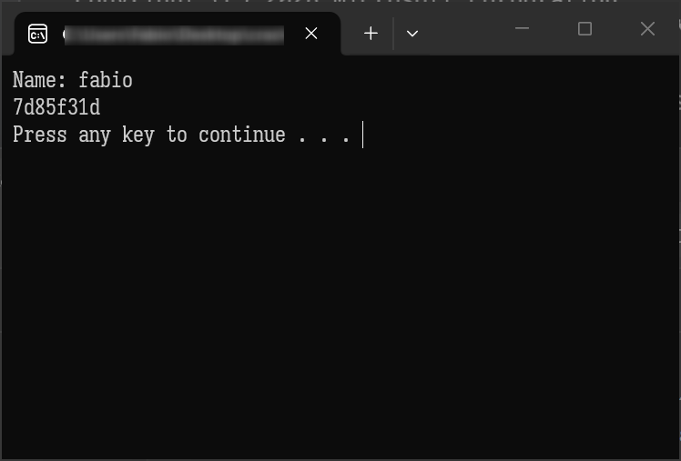
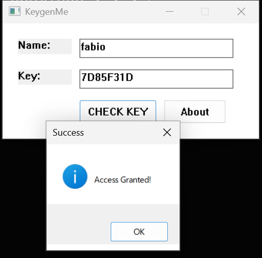

# Coder_90's KeyGenMeV3

Source: https://crackmes.one/crackme/691f53d32d267f28f69b7f62

####    by 4next_re 

## Tools Used

| Tool                           | Reference URL                                       |
| ------------------------------ | --------------------------------------------------- |
| CFF Explorer                   | [https://ntcore.com/explorer-suite/](https://ntcore.com/explorer-suite/)                            |
| Hex Rays IDA                   | [https://hex-rays.com](https://hex-rays.com)        |
| MASM64 SDK                     | https://masm32.com                                  |
| Microsoft C++ Build Tools v145 | https://visualstudio.microsoft.com/it/vs/community/ |


## The Analysis

The executable seems to having been built on Embarcadero (former Inprise, former Borland) Cross Platform Build System



As it usually happens with applications like this, the first step is watching its behavior :



So we collect a useful information about the fact that in case of wrong password value, the application notifies it with a message box stating "Invalid Key".

Next step it's trying to analyze the executable with the preferred tool. Mine is HexRays' IDA.

The main straightforward indicator at this point is that the application uses a MessageBox  to notify the result of the data validation. 

Let's go straight to IDA Imports to identify the MessageBox import



```assembly
.idata:0000000140005C58 ; int (__stdcall *MessageBoxA)(HWND hWnd, LPCSTR lpText, LPCSTR lpCaption, UINT uType)
.idata:0000000140005C58                 extrn __imp_MessageBoxA:qword
.idata:0000000140005C58                                         ; DATA XREF: MessageBoxA↑r
```

we follow the import entry DATA cross reference in .text section wrapper procedure :

```assembly
.text:0000000140003F30 ; int __stdcall MessageBoxA(HWND hWnd, LPCSTR lpText, LPCSTR lpCaption, UINT uType)
.text:0000000140003F30 MessageBoxA     proc near               ; CODE XREF: sub_140001A40:loc_140001E53↑p
.text:0000000140003F30                 jmp     cs:__imp_MessageBoxA
.text:0000000140003F30 MessageBoxA     endp
```

that is directly referenced by a the procedure labeled **sub_140001A40** at offset location **loc_140001E53** within the WindProc procedure at sub_7FF6357B1A40:

```assembly
.text:0000000140001DF9 loc_140001DF9:                          ; CODE XREF: sub_140001A40+2C7↑j
.text:0000000140001DF9                 imul    edx, edx
.text:0000000140001DFC                 mov     eax, edx
.text:0000000140001DFE                 shl     eax, 8
.text:0000000140001E01                 sub     eax, edx
.text:0000000140001E03                 rol     edi, 1Dh
.text:0000000140001E06                 add     edi, ecx
.text:0000000140001E08                 xor     edi, eax
.text:0000000140001E0A                 lea     rcx, [rsp+298h+var_138] ; String
.text:0000000140001E12                 xor     edx, edx        ; EndPtr
.text:0000000140001E14                 mov     r8d, 10h        ; Radix
.text:0000000140001E1A                 call    strtoul
.text:0000000140001E1F                 cmp     edi, eax
.text:0000000140001E21                 jnz     short loc_140001E3C
.text:0000000140001E23                 lea     rdx, aAccessGranted ; "Access Granted!"
.text:0000000140001E2A                 lea     r8, aSuccess    ; "Success"
.text:0000000140001E31                 mov     rcx, rsi
.text:0000000140001E34                 mov     r9d, 40h ; '@'
.text:0000000140001E3A                 jmp     short loc_140001E53
.text:0000000140001E3C ; ---------------------------------------------------------------------------
.text:0000000140001E3C
.text:0000000140001E3C loc_140001E3C:                          ; CODE XREF: sub_140001A40+3E1↑j
.text:0000000140001E3C                 lea     rdx, Text       ; "Invalid Key"
.text:0000000140001E43                 lea     r8, Caption     ; "Failed"
.text:0000000140001E4A                 mov     rcx, rsi        ; hWnd
.text:0000000140001E4D                 mov     r9d, 10h        ; uType
.text:0000000140001E53
.text:0000000140001E53 loc_140001E53:                          ; CODE XREF: sub_140001A40+3FA↑j
.text:0000000140001E53                 call    MessageBoxA
```

and there we go we found the place where the validation results are evaluated. And the last function called followed by a comparison that will determine the jump to the "*Granted Access*" or *"Invalid Key"* is Standard C (msvcrtlib) library **[strtoul](https://learn.microsoft.com/en-us/cpp/c-runtime-library/reference/strtoul-strtoul-l-wcstoul-wcstoul-l?view=msvc-170)** whose result is checked against the previously computed value, presumably using some sort of encoding of the provided user name string.  

So the checkpoint is based on a computed value featuring numeric values.

Going backward the code relative to this block we identify encoding logics even due to the suspect (**0DEADC0DEh**) value a couple of lines up:

```assembly
.text:0000000140001DED loc_140001DED:                          ; CODE XREF: sub_140001A40+287↑j
.text:0000000140001DED                 mov     edi, 55555555h
.text:0000000140001DF2                 mov     ecx, 0DEADC0DEh
.text:0000000140001DF7                 xor     edx, edx
```

 that is a hint that something is going on around here.

The encoding procedure is summarized in the following code block. 

The Name input string (ASCII) value is gathered via GetWindowTextA Win32 API. Name's length is then obtained via CRT's **strlen** function and then some hashing is done and returned in EAX register.

```assembly


.text:00007FF6357B1C82                 mov     rcx, cs:hWnd    ; hWnd
.text:00007FF6357B1C89                 lea     rdi, [rsp+298h+Name]
.text:00007FF6357B1C8E                 mov     rdx, rdi        ; lpString
.text:00007FF6357B1C91                 mov     r8d, 100h       ; nMaxCount
.text:00007FF6357B1C97                 call    GetWindowTextA
									   
									   
								mov     rcx, rdi        ; String Name
.text:00007FF6357B1CB9                 call    strlen
.text:00007FF6357B1CBE                 movzx   r8d, [rsp+298h+Name]
.text:00007FF6357B1CC4                 test    r8b, r8b
.text:00007FF6357B1CC7                 jz      loc_7FF6357B1DED
.text:00007FF6357B1CCD                 neg     eax
.text:00007FF6357B1CCF                 mov     ecx, 0DEADC0DEh
.text:00007FF6357B1CD4                 mov     edi, 55555555h
.text:00007FF6357B1CD9                 xor     edx, edx
.text:00007FF6357B1CDB                 jmp     short loc_7FF6357B1D0D

.text:00007FF6357B1CBE                 movzx   r8d, [rsp+298h+Name]
.text:00007FF6357B1CC4                 test    r8b, r8b
.text:00007FF6357B1CC7                 jz      loc_7FF6357B1DED
.text:00007FF6357B1CCD                 neg     eax
.text:00007FF6357B1CCF                 mov     ecx, 0DEADC0DEh
.text:00007FF6357B1CD4                 mov     edi, 55555555h
.text:00007FF6357B1CD9                 xor     edx, edx
.text:00007FF6357B1CDB                 jmp     short loc_7FF6357B1D0D

.text:00007FF6357B1CE0 loc_7FF6357B1CE0:                       ; CODE XREF: sub_7FF6357B1A40+2D5↓j
.text:00007FF6357B1CE0                 rol     edi, 0Ch
.text:00007FF6357B1CE3                 xor     edi, r8d
.text:00007FF6357B1CE6                 add     edi, 90F01234h
.text:00007FF6357B1CEC
.text:00007FF6357B1CEC loc_7FF6357B1CEC:                       ; CODE XREF: sub_7FF6357B1A40+2E3↓j
.text:00007FF6357B1CEC                 mov     r8d, ecx
.text:00007FF6357B1CEF                 add     r8d, edx
.text:00007FF6357B1CF2                 lea     ecx, [r8+rax]
.text:00007FF6357B1CF6                 xor     ecx, r8d        ; hWnd
.text:00007FF6357B1CF9                 xor     edi, ecx
.text:00007FF6357B1CFB                 movzx   r8d, [rsp+rdx+298h+Name+1]
.text:00007FF6357B1D01                 inc     rdx             ; Msg
.text:00007FF6357B1D04                 test    r8b, r8b
.text:00007FF6357B1D07                 jz      loc_7FF6357B1DF9

						loc_7FF6357B1D0D:                       ; CODE XREF: sub_7FF6357B1A40+29B↑j
.text:00007FF6357B1D0D                 movzx   r8d, r8b        ; wParam
.text:00007FF6357B1D11                 test    r8b, 1
.text:00007FF6357B1D15                 jz      short loc_7FF6357B1CE0
.text:00007FF6357B1D17                 rol     edi, 1Dh
.text:00007FF6357B1D1A                 add     edi, r8d
.text:00007FF6357B1D1D                 add     edi, 0E5D4C3B3h
.text:00007FF6357B1D23                 jmp     short loc_7FF6357B1CEC

.text:00007FF6357B1DED loc_7FF6357B1DED:                       ; CODE XREF: sub_7FF6357B1A40+287↑j
.text:00007FF6357B1DED                 mov     edi, 55555555h
.text:00007FF6357B1DF2                 mov     ecx, 0DEADC0DEh
.text:00007FF6357B1DF7                 xor     edx, edx

.text:00007FF6357B1DF9 loc_7FF6357B1DF9:                       ; CODE XREF: sub_7FF6357B1A40+2C7↑j
.text:00007FF6357B1DF9                 imul    edx, edx
.text:00007FF6357B1DFC                 mov     eax, edx
.text:00007FF6357B1DFE                 shl     eax, 8
.text:00007FF6357B1E01                 sub     eax, edx
.text:00007FF6357B1E03                 rol     edi, 1Dh
.text:00007FF6357B1E06                 add     edi, ecx
.text:00007FF6357B1E08                 xor     edi, eax
.text:00007FF6357B1E0A                 lea     rcx, [rsp+298h+Key] ; Key String
.text:00007FF6357B1E12                 xor     edx, edx        ; EndPtr
.text:00007FF6357B1E14                 mov     r8d, 10h        ; Radix
.text:00007FF6357B1E1A                 call    strtoul
.text:00007FF6357B1E1F                 cmp     edi, eax
.text:00007FF6357B1E21                 jnz     short loc_7FF6357B1E3C
.text:00007FF6357B1E23                 lea     rdx, aAccessGranted ; "Access Granted!"
.text:00007FF6357B1E2A                 lea     r8, aSuccess    ; "Success"
.text:00007FF6357B1E31                 mov     rcx, rsi
.text:00007FF6357B1E34                 mov     r9d, 40h ; '@'
.text:00007FF6357B1E3A                 jmp     short loc_7FF6357B1E53
.text:00007FF6357B1E3C ; ---------------------------------------------------------------------------
.text:00007FF6357B1E3C
.text:00007FF6357B1E3C loc_7FF6357B1E3C:                       ; CODE XREF: sub_7FF6357B1A40+3E1↑j
.text:00007FF6357B1E3C                 lea     rdx, Text       ; "Invalid Key"
.text:00007FF6357B1E43                 lea     r8, Caption     ; "Failed"
.text:00007FF6357B1E4A                 mov     rcx, rsi        ; hWnd
.text:00007FF6357B1E4D                 mov     r9d, 10h        ; uType
.text:00007FF6357B1E53
.text:00007FF6357B1E53 loc_7FF6357B1E53:                       ; CODE XREF: sub_7FF6357B1A40+3FA↑j
.text:00007FF6357B1E53                 call    MessageBoxA
```

Looking carefully, the hashing logic is based on magic constants added to character value being odd or even.

For Evens:

```assembly
rol     eax, 0Ch             ; Rotate hash left by 12 bits
xor     eax, r9d             ; XOR with character value
add     eax, 90F01234h       ; Add magic constant
```

For Odds:

```assembly
rol     eax, 1Dh             ; Rotate hash left by 29 bits
add     eax, r9d             ; Add character value
add     eax, 0E5D4C3B3h      ; Add magic constant
```


Aside from this, by inspecting more extensively the code (by searching magic DEADC0DEh value) we find something awesome:

```assembly
.text:00007FF6357B1610
.text:00007FF6357B1610 sub_7FF6357B1610 proc near              ; DATA XREF: .pdata:00007FF635B3006C↓o
.text:00007FF6357B1610                 push    rsi
.text:00007FF6357B1611                 sub     rsp, 20h
.text:00007FF6357B1615                 mov     rsi, rcx
.text:00007FF6357B1618                 call    strlen
.text:00007FF6357B161D                 movzx   r9d, byte ptr [rsi]
.text:00007FF6357B1621                 test    r9b, r9b
.text:00007FF6357B1624                 jz      short loc_7FF6357B167F
.text:00007FF6357B1626                 mov     rcx, rax
.text:00007FF6357B1629                 neg     ecx
.text:00007FF6357B162B                 mov     edx, 0DEADC0DEh
.text:00007FF6357B1630                 mov     eax, 55555555h
.text:00007FF6357B1635                 xor     r8d, r8d
.text:00007FF6357B1638                 jmp     short loc_7FF6357B1668
.text:00007FF6357B1638 ; ---------------------------------------------------------------------------
.text:00007FF6357B163A                 align 20h
.text:00007FF6357B1640
.text:00007FF6357B1640 loc_7FF6357B1640:                       ; CODE XREF: sub_7FF6357B1610+60↓j
.text:00007FF6357B1640                 rol     eax, 0Ch
.text:00007FF6357B1643                 xor     eax, r9d
.text:00007FF6357B1646                 add     eax, 90F01234h
.text:00007FF6357B164B
.text:00007FF6357B164B loc_7FF6357B164B:                       ; CODE XREF: sub_7FF6357B1610+6D↓j
.text:00007FF6357B164B                 mov     r9d, edx
.text:00007FF6357B164E                 add     r9d, r8d
.text:00007FF6357B1651                 lea     edx, [r9+rcx]
.text:00007FF6357B1655                 xor     edx, r9d
.text:00007FF6357B1658                 xor     eax, edx
.text:00007FF6357B165A                 movzx   r9d, byte ptr [rsi+r8+1]
.text:00007FF6357B1660                 inc     r8
.text:00007FF6357B1663                 test    r9b, r9b
.text:00007FF6357B1666                 jz      short loc_7FF6357B168C
.text:00007FF6357B1668
.text:00007FF6357B1668 loc_7FF6357B1668:                       ; CODE XREF: sub_7FF6357B1610+28↑j
.text:00007FF6357B1668                 movzx   r9d, r9b
.text:00007FF6357B166C                 test    r9b, 1
.text:00007FF6357B1670                 jz      short loc_7FF6357B1640
.text:00007FF6357B1672                 rol     eax, 1Dh
.text:00007FF6357B1675                 add     eax, r9d
.text:00007FF6357B1678                 add     eax, 0E5D4C3B3h
.text:00007FF6357B167D                 jmp     short loc_7FF6357B164B
.text:00007FF6357B167F ; ---------------------------------------------------------------------------
.text:00007FF6357B167F
.text:00007FF6357B167F loc_7FF6357B167F:                       ; CODE XREF: sub_7FF6357B1610+14↑j
.text:00007FF6357B167F                 mov     eax, 55555555h
.text:00007FF6357B1684                 mov     edx, 0DEADC0DEh
.text:00007FF6357B1689                 xor     r8d, r8d
.text:00007FF6357B168C
.text:00007FF6357B168C loc_7FF6357B168C:                       ; CODE XREF: sub_7FF6357B1610+56↑j
.text:00007FF6357B168C                 imul    r8d, r8d
.text:00007FF6357B1690                 mov     ecx, r8d
.text:00007FF6357B1693                 shl     ecx, 8
.text:00007FF6357B1696                 rol     eax, 1Dh
.text:00007FF6357B1699                 sub     ecx, r8d
.text:00007FF6357B169C                 add     eax, edx
.text:00007FF6357B169E                 xor     eax, ecx
.text:00007FF6357B16A0                 add     rsp, 20h
.text:00007FF6357B16A4                 pop     rsi
.text:00007FF6357B16A5                 retn
.text:00007FF6357B16A5 sub_7FF6357B1610 endp
```

That is exactly the username hashing algorithm we have been observing previously with one difference: this function returns the integer value, that in the main check function is converted to its hexadecimal representation.

Unreferenced function and maybe mistakenly forgotten in the compiled code. 

So we rip it off and use it straight in our MASM64 and MSVC C/C++ solution that follow.


## The Solution

### MASM64 Source - keygenme_solution_masm.asm

```assembly

  include     \masm64\include64\masm64rt.inc
  includelib  \masm64\lib64\msvcrt.lib 

  strlen PROTO C :PTR BYTE
  scanf PROTO C :PTR BYTE, :VARARG
  
  .data
    
    input db 64 dup(0)
    sN db "%s",0
    
  .code

entry_point proc

    conout "Name: "
    mov rdx, offset input
    mov rcx, offset sN
    call scanf
    
    mov rcx, offset input
    call keygen

    conout "Key : ", hex$(rax), lf 

    invoke ExitProcess, 0

    ret

entry_point endp


keygen proc               
                push    rsi
                sub     rsp, 20h
                mov     rsi, rcx
                call    strlen
                movzx   r9d, byte ptr [rsi]
                test    r9b, r9b
                jz      short loc_7FF74A23167F
                mov     rcx, rax
                neg     ecx
                mov     edx, 0DEADC0DEh
                mov     eax, 55555555h
                xor     r8d, r8d
                jmp     short loc_7FF74A231668
; ---------------------------------------------------------------------------
                align 10h

loc_7FF74A231640:                       
                rol     eax, 0Ch
                xor     eax, r9d
                add     eax, 90F01234h

loc_7FF74A23164B:                       
                mov     r9d, edx
                add     r9d, r8d
                lea     edx, [r9+rcx]
                xor     edx, r9d
                xor     eax, edx
                movzx   r9d, byte ptr [rsi+r8+1]
                inc     r8
                test    r9b, r9b
                jz      short loc_7FF74A23168C

loc_7FF74A231668:                       
                movzx   r9d, r9b
                test    r9b, 1
                jz      short loc_7FF74A231640
                rol     eax, 1Dh
                add     eax, r9d
                add     eax, 0E5D4C3B3h
                jmp     short loc_7FF74A23164B
; ---------------------------------------------------------------------------

loc_7FF74A23167F:                       
                mov     eax, 55555555h
                mov     edx, 0DEADC0DEh
                xor     r8d, r8d

loc_7FF74A23168C:                       
                imul    r8d, r8d
                mov     ecx, r8d
                shl     ecx, 8
                rol     eax, 1Dh
                sub     ecx, r8d
                add     eax, edx
                xor     eax, ecx

                add     rsp, 20h
                pop     rsi
                ret
keygen endp

    end
   

```

### MASM64 Build Script

```cmd
@echo off

set appname=keygenme_solution_masm

del %appname%.obj
del %appname%.exe

C:\masm64\bin64\ml64.exe /c %appname%.asm

C:\masm64\bin64\link.exe /SUBSYSTEM:CONSOLE /MACHINE:X64 /ENTRY:entry_point /nologo /LARGEADDRESSAWARE %appname%.obj

dir %appname%.*

pause
```






### MSVC C/C++ Source - keygenme_solution_msvc.cpp

```c++

#include <iostream>

#define ZERO_LOWDWORD(val) ((val) &= ~(int64_t)0xFFFFFFFF)

typedef unsigned long DWORD;

inline uint32_t rol32(uint32_t value, uint32_t count)
{
    count &= 31;
    return (value << count) | (value >> (32 - count));
}

__int64 __fastcall sub_7FF6357B1610(const char* source)
{
    int source_len;                 // eax
    unsigned __int8 source_char;    // r9
    int v4;                         // ecx
    int v5;                         // edx
    int v6;                         // eax
    __int64 v7;                     // r8
    int v8;                         // eax

    source_len = strlen(source);
    source_char = *source;

    if (*source)
    {
        v4 = -source_len;
        v5 = 0xDEADC0DE;
        v6 = 0x55555555;
        v7 = 0;
        do
        {
            if ((source_char & 1) != 0)
                v8 = source_char + rol32(v6, 29) - 0x1A2B3C4D;
            else
                v8 = (source_char ^ rol32(v6, 12)) - 0x6F0FEDCC;

            v5 = (v7 + v5) ^ (v7 + v5 + v4);
            v6 = v5 ^ v8;
            source_char = source[++v7];
        } while (source_char);
    }
    else
    {
        v6 = 0x55555555;
        v5 = 0xDEADC0DE;
        ZERO_LOWDWORD(v7);
    }
    return (255 * (DWORD)v7 * (DWORD)v7) ^ (unsigned int)(v5 + rol32(v6, 29));
}


int main()
{
    std::string username;
    char buffer[64] = {'\0'};

    std::cout << "Name" << ": ";
    std::cin >> username;

    __int64 code = sub_7FF6357B1610(username.c_str());
    
    _itoa_s(code, buffer, 64, 0x10);

    std::cout<<buffer<<std::endl;

    system("pause");
}


```

### MSVC C/C++ Build Script

```bat
@echo off

SET appname=keygenme_solution_msvc

CALL "C:\Program Files\Microsoft Visual Studio\18\Community\Common7\Tools\VsDevCmd.bat" -startdir=none -arch=x64 -host_arch=x64

cl /EHsc .\%appname%.cpp

DIR %appname%.*

PAUSE
```








