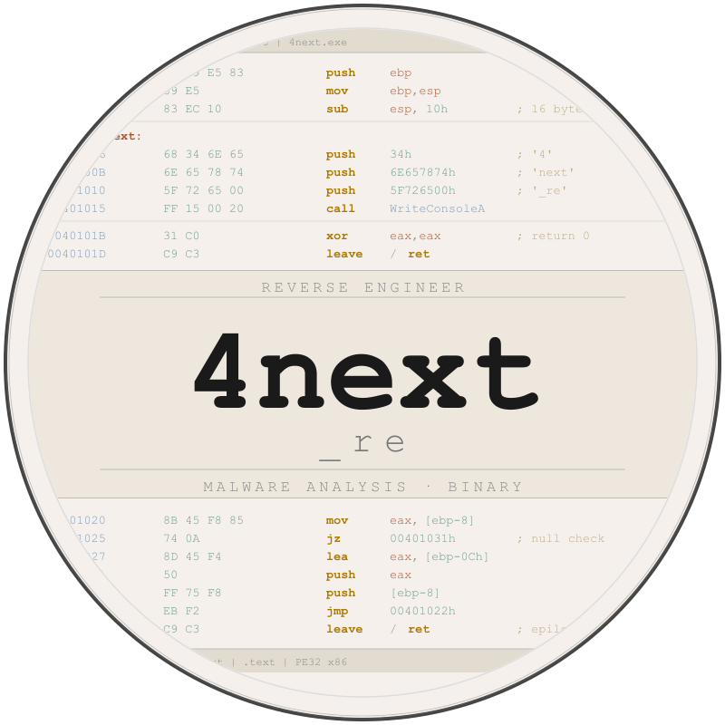
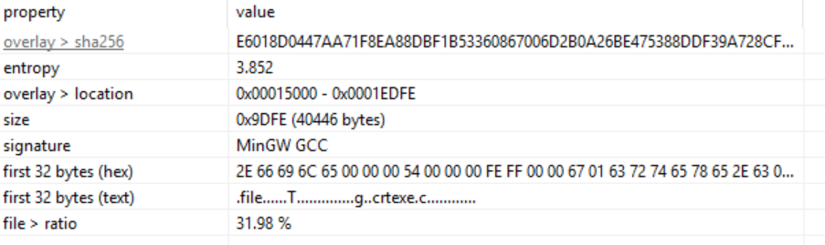
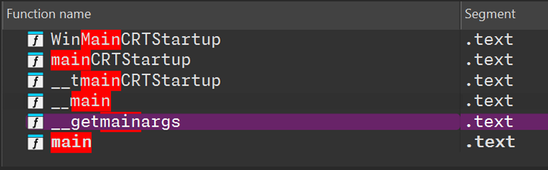
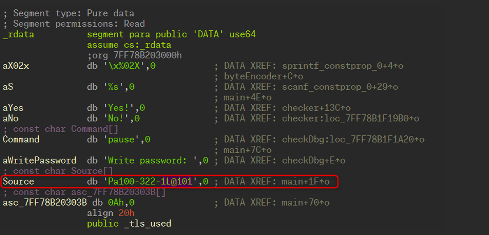
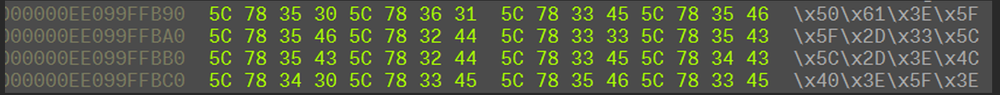
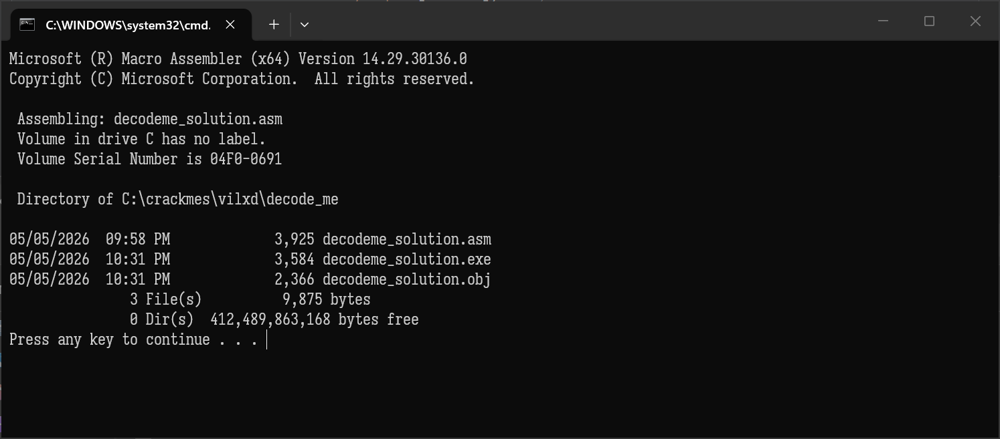
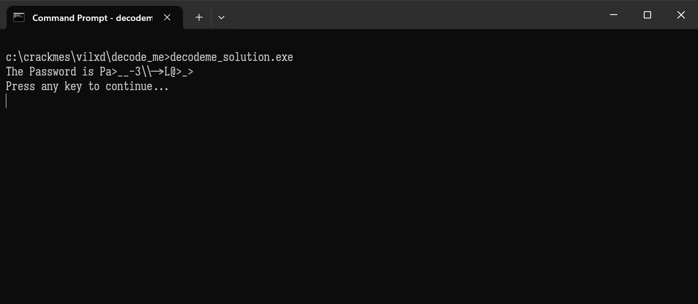
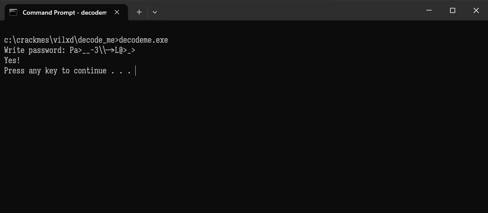

# vilxd's decode me 

Source: https://crackmes.one/crackme/69245c422d267f28f69b806e


####    by 4next_re 


#####  previously published with my former handle "__patbateman__" (pending account deletion on crackmes.one)

## Tools Used

| Tool         | Reference URL            |
| ------------ | ------------------------ |
| PE Studio    | https://www.winitor.com/ |
| Hex Rays IDA | https://hex-rays.com     |
| MASM64 SDK   | https://masm32.com       |

## The Analysis

As it usually happens with applications like this, the first step is watching its behavior :

```
Write password: abracadabra
No!
```

So we collect a basic and useful information about the fact that in case of wrong password value, the application clearly notifies it with a console message stating "No!".

Upon initial analysis using PE Studio we find out that the executable is compiled using MinGW GCC:



 Once opened and analyzed with IDA, in the function name panel we find a few "main" procs to start from:



and reach the one we're interested in:

```assembly
; =============== S U B R O U T I N E =======================================


; int __fastcall main(int argc, const char **argv, const char **envp)
                public main
main            proc near               ; CODE XREF: __tmainCRTStartup+1E7↑p
                                        ; DATA XREF: .pdata:00007FF78B205780↓o

Destination     = byte ptr -358h
Str1            = byte ptr -288h
Str2            = byte ptr -1B8h
Str             = byte ptr -0E8h

                push    rdi
                push    rsi
                push    rbx
                sub     rsp, 360h
                lea     rsi, [rsp+378h+Destination]
                lea     rbx, [rsp+378h+Str1]
                call    __main
                mov     rdx, rsi        ; Destination
                lea     rcx, Source     ; "Pa100-322-1L@101"
                lea     rdi, [rsp+378h+Str]
                call    transformChar
                mov     rdx, rbx
                mov     rcx, rsi        ; Str
                lea     rsi, [rsp+378h+Str2]
                call    byteEncoder
                call    checkDbg
                mov     rdx, rdi
                lea     rcx, aS         ; "%s"
                call    scanf_constprop_0
                mov     rdx, rsi
                mov     rcx, rdi        ; Str
                call    byteEncoder
                mov     rdx, rsi        ; Str2
                mov     rcx, rbx        ; Str1
                call    checker
                lea     rcx, asc_7FF78B20303B ; "\n"
                call    printf
                lea     rcx, Command    ; "pause"
                call    system_0
                xor     eax, eax
                add     rsp, 360h
                pop     rbx
                pop     rsi
                pop     rdi
                retn
main            endp
```

IDA Analysis does a lot of work for us, and we see that application procedures have been compiled with the original meaningful names. 
This help us a lot instead of dealing with usual  anonymous sub_[address] names that IDA naming convention applies.

From a quick view we see that the interesting block for our purpose is this one:

```assembly
                mov     rdx, rsi        	; Destination
                lea     rcx, Source     	; "Pa100-322-1L@101"
                lea     rdi, [rsp+378h+Str]
                call    transformChar
```

From reading this we understand that RCX register (the first parameter passed to the procedure as x64 ABI calling convention) is loaded with the address of the hard coded key in .rdata section



RDX (the second parameter passed to the procedure) is loaded with RSI register that in turn was loaded with the local stack va-riable address, *Destination*,  a few lines before.

So, basically, something interesting is happening here: there's a fixed string value, a destination buffer and a procedure called **transformChar**.  At the end of the day, what is going to be put in *Destination*? :-)

```assembly
                mov     rdx, rsi        	; Destination
                lea     rcx, Source     	; "Pa100-322-1L@101"
                lea     rdi, [rsp+378h+Str]
                call    transformChar
```

 later on some byte encoding stuff is performed over the *Destination* buffer:

```assembly
                mov     rdx, rbx
                mov     rcx, rsi        ; Str
                lea     rsi, [rsp+378h+Str2]
                call    byteEncoder
```

on line 2 the RSI register that is holding the stack address of *Destination* buffer, is copied to RCX that in turn will be passed as first parameter to **byteEncoder** procedure, while RDX is loaded with RBX that is holding the address to the destination buffer for the newly encoded byte string. 

So, once called, byteEncoder, will have RBX pointing to the encoded string that is something like:



a call to **checkDebug**  is then issued and it is pretty useless apart from the fact that it prints "Write Password:" if no debugger is de-tected, otherwise it issues a Terminal Shell PAUSE  waiting for a key press and then executes the program anyway.

```assembly
checkDbg        proc near               
                                        
                sub     rsp, 28h
                call    cs:__imp_IsDebuggerPresent
                test    eax, eax
                jnz     short loc_7FF642171A20
                lea     rcx, aWritePassword ; "Write password: "
                add     rsp, 28h
                jmp     printf
; ---------------------------------------------------------------------------
                align 20h

loc_7FF642171A20:                       ; CODE XREF: checkDbg+C↑j
                lea     rcx, Command    ; "pause"
                add     rsp, 28h
                jmp     system_0
checkDbg        endp
```

 I would have expected at least a call to **ExitProcess** and game over.


The user input is requested via a wrapper procedure for MinGW **scanf**: RCX is holding address of "%s" format string in .rdata sec-tion and RDI is holding pointer to local stack buffer *Str*

```assembly
                mov     rdx, rdi
                lea     rcx, aS         ; "%s"
                call    scanf_constprop_0
```

and, in turn, RDI is passed to **byteEncoder** function again to process the user input data, having RDX pointing to destination buf-fer of encoded byte string *Str2*:

```assembly
                mov     rdx, rsi
                mov     rcx, rdi        ; Str
                call    byteEncoder
```

 Finally *Str1* and *Str2* encoded byte strings are passed to **checker** procedure that will perform the comparison between the two strings at offset checker location loc_7FF642171989:

```assembly
loc_7FF642171989:                       ; CODE XREF: checker+193↓j
                mov     byte ptr [r10], 0
                mov     rdx, r9         ; Str2
                mov     rcx, r8         ; Str1
                call    strcmp
                test    eax, eax
                jnz     short loc_7FF6421719B0
                lea     rcx, aYes       ; "Yes!"
                add     rsp, 28h
                jmp     printf
; ---------------------------------------------------------------------------
                align 10h

loc_7FF6421719B0:                       ; CODE XREF: checker+13A↑j
                lea     rcx, aNo        ; "No!"
                add     rsp, 28h
                jmp     printf
; ---------------------------------------------------------------------------
```

From now on, there are two approaches: 

1.  Go straight debugging and see what the application flow is like by inspecting registers and memory 
2.  Start off a static analysis of code and rip off any useful algorithm. My usual way is starting off with a quick debugging session to get the idea of the flow and the used algorithm and then in turn, if necessary, proceed with a static analysis. 

In this specific scenario, since we are just searching for the password and not keygenning it, a quick debugging session is enough by simply stopping after the first call of **transformChar** and taking note of the *Destination* buffer containing the transformed string from hard coded *Source* "Pa100-322-1L@101"...

## The Solution: 

```ini
Pa>__-3\\->L@>_>
```

One thing that I have always found funny is leveraging and using the actual application assembly code to produce its crack/serial exploit/keygen code. 

The following source solution, using MASM64 package, is using the **transformChar** assembly code proce-dure to print the serial for the application's hard coded  value.

### Source

```assembly


    include     \masm64\include64\masm64rt.inc
    includelib  \masm64\lib64\msvcrt.lib 

    strcpy PROTO C :PTR BYTE, :PTR BYTE
 
    .data
      
      Source db "Pa100-322-1L@101", 0  

      Decoded db 64 dup(0)
      
    .text

entry_point proc

    invoke decodeme_main

    conout "The Password is ", ADDR Decoded, lf 

    waitkey

    invoke ExitProcess, 0

    ret

entry_point endp


decodeme_main proc                
                                        

Destination     equ byte ptr -358h
Str1            equ byte ptr -288h
Str2            equ byte ptr -1B8h
Str0            equ byte ptr -0E8h

                push    rdi
                push    rsi
                push    rbx
                sub     rsp, 360h
                lea     rsi, [rsp+378h+Destination]
                lea     rbx, [rsp+378h+Str1]

                mov     rdx, rsi              ; Destination
                lea     rcx, Source           ; "Pa100-322-1L@101"
                lea     rdi, [rsp+378h+Str0]
                call    transformChar

                lea     rsi, [rsp+378h+Destination]

                mov     rcx, offset Decoded
                mov     rdx, rsi
                call    strcpy

                add     rsp, 360h
                pop     rbx
                pop     rsi
                pop     rdi
                ret

decodeme_main   endp


transformChar   proc                    
                                        
                push    rbx
                sub     rsp, 20h
                mov     rbx, rcx
                mov     rcx, rdx        ; Destination
                mov     rdx, rbx        ; Source
                call    strcpy
                mov     rcx, rax
                movzx   eax, byte ptr [rbx]
                test    al, al
                jz      short loc_140001744
                xor     edx, edx
                jmp     short loc_140001730
; ---------------------------------------------------------------------------
                align 8

                loc_140001718:                          
                                cmp     al, 31h ; '1'
                                jz      short loc_140001750
                                cmp     al, 32h ; '2'
                                jnz     short loc_140001724
                                mov     byte ptr [rcx+rdx], 5Ch ; '\'

                loc_140001724:                          
                                                        
                                add     rdx, 1
                                movzx   eax, byte ptr [rbx+rdx]
                                test    al, al
                                jz      short loc_140001744

                loc_140001730:                          
                                                        
                                cmp     al, 30h ; '0'
                                jnz     short loc_140001718
                                mov     byte ptr [rcx+rdx], 5Fh ; '_'
                                add     rdx, 1
                                movzx   eax, byte ptr [rbx+rdx]
                                test    al, al
                                jnz     short loc_140001730

                loc_140001744:                          
                                                        
                                add     rsp, 20h
                                pop     rbx
                                ret
                ; ---------------------------------------------------------------------------
                                align 10h

                loc_140001750:                          
                                mov     byte ptr [rcx+rdx], 3Eh ; '>'
                                jmp     short loc_140001724
transformChar   endp

    end
   

```

### Build Script

```cmd
@echo off

set appname=decodeme_solution

del %appname%.obj
del %appname%.exe

C:\masm64\bin64\ml64.exe /c %appname%.asm

C:\masm64\bin64\link.exe /SUBSYSTEM:CONSOLE /MACHINE:X64 /ENTRY:entry_point /nologo /LARGEADDRESSAWARE %appname%.obj

dir %appname%.*

pause
```





Using the password in the original program, we succeed:



